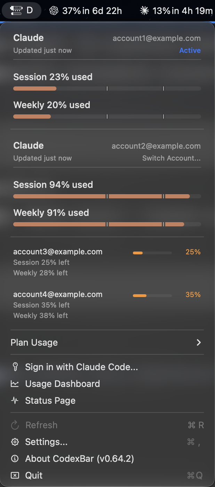
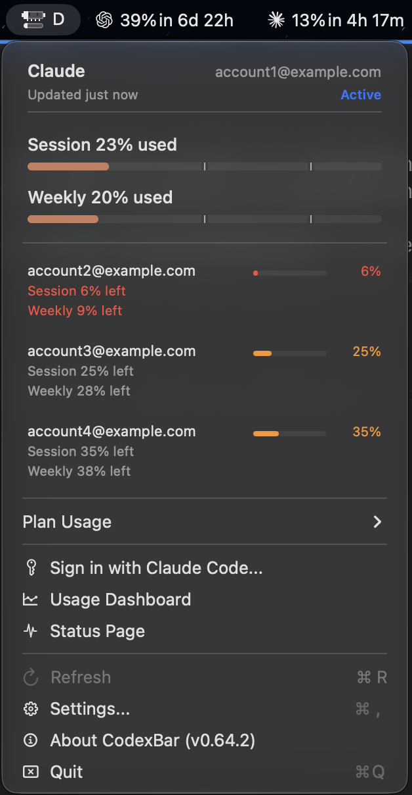

# Native account-card persistence proof

Verified on macOS on September 22, 2026, using the packaged debug app built from
`ca27867cf8bcdef9b72dfa31236604e31219e7bb` (CodexBar 0.64.2).
[Build identity and executable hash](build.json).

The user performed the real menu clicks and supplied the screenshots below.
The agent checked the persisted preference and terminated/relaunched the actual
app between steps 3–4 and 5–6. The old process exited before each new launch:
PID 1787 → 18498 → 77285. Restarts used SIGTERM followed by launching the same
packaged executable; this was not a settings-object reconstruction or a unit test.
[Timestamped process and defaults observations](runtime-proof.json).

The app used an isolated home and preferences domain, with Keychain access
disabled and a stub `cswap --list` returning four synthetic accounts. No real
account credentials or live provider probes were used for this fixture. The
fixture's active account remained account1; only account2's presentation changed.
The defaults key was read for evidence, never written to simulate a click.

| Step | Action and observed result | Screenshot |
| --- | --- | --- |
| 1 | Open menu: inactive account2 starts compact. | [Initial state](01-initial-collapsed.png) |
| 2 | Click account2: full Session and Weekly bars appear. | [Expanded](02-expanded.png) |
| 3 | Close and reopen menu: account2 stays expanded (user confirmed). | [After menu reopening](03-expanded-after-menu-reopen.png) |
| 4 | Restart app, then open menu without expanding anything: account2 stays expanded. | [After first restart](04-expanded-after-app-restart.png) |
| 5 | Click account2's heading: account2 becomes compact; persisted expansion set is empty. | [Collapsed](05-collapsed.png) |
| 6 | Restart app again, then open menu: account2 stays compact. | [After second restart](06-collapsed-after-app-restart.png) |

## Expanded after restarting the app

## Collapsed after restarting the app again

